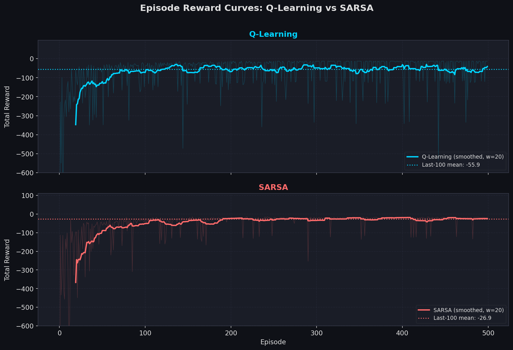
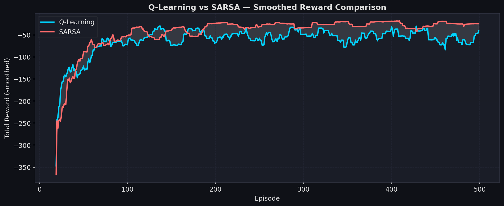
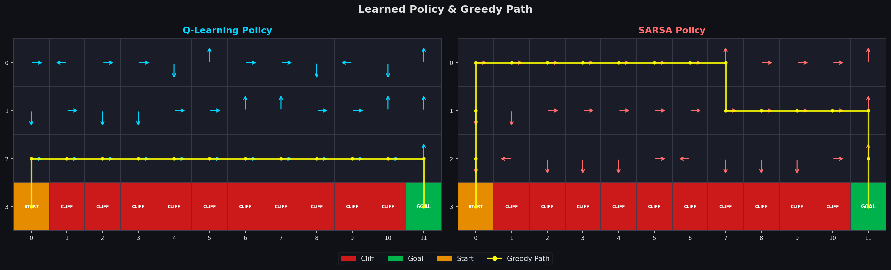
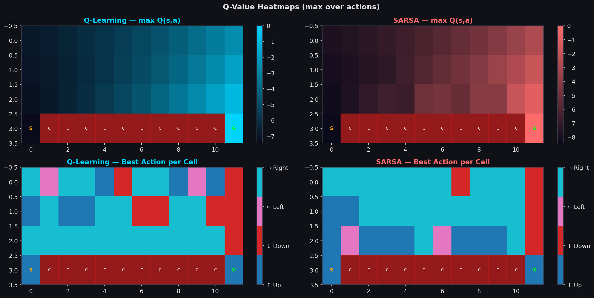
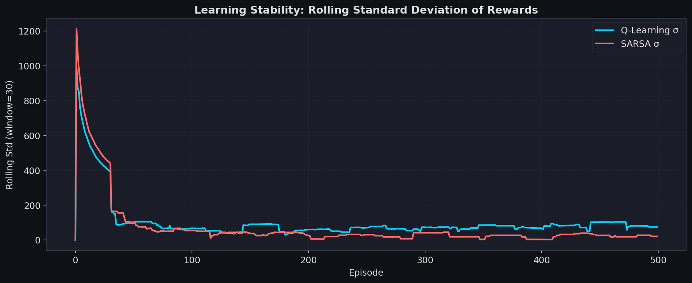
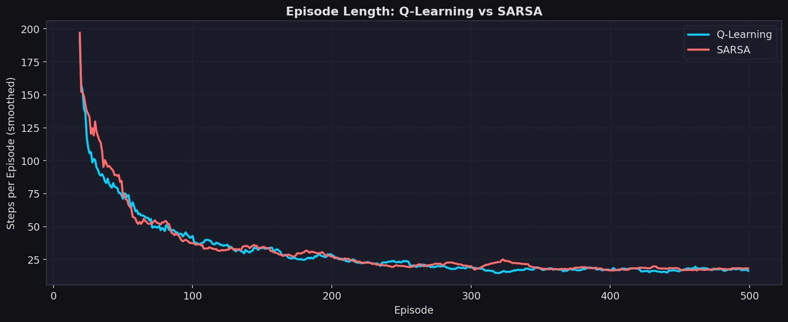
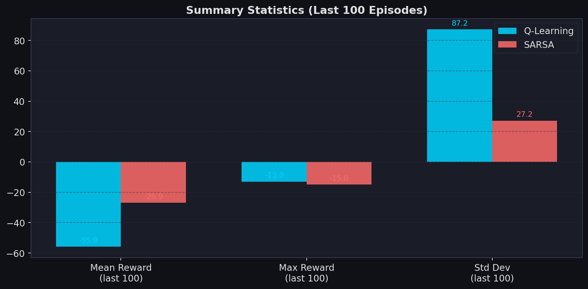

# Q-Learning vs SARSA 強化學習比較報告

> **環境**：Cliff Walking（4 × 12 GridWorld）｜**演算法**：Q-Learning、SARSA  
> **參數**：α = 0.1 ｜ γ = 0.9 ｜ ε = 0.1 ｜ 訓練回合 = 500 ｜ 隨機種子 = 42

---

## 一、實驗概覽

本實驗在相同的 Cliff Walking 環境與超參數條件下，比較 **Q-Learning（離策略）** 與 **SARSA（同策略）** 兩種時間差分（TD）學習演算法的學習行為、收斂特性與最終策略。

### 環境說明

| 屬性 | 設定 |
|------|------|
| 網格大小 | 4 × 12（共 48 個狀態） |
| 起點 | 左下角 (3, 0) |
| 終點 | 右下角 (3, 11) |
| 懸崖 | 底部第 1 至第 10 格 |
| 每步獎勵 | −1 |
| 掉入懸崖 | −100，重置至起點 |
| 到達終點 | 回合結束 |

### 演算法更新公式

**Q-Learning（Off-policy）**
$$Q(s,a) \leftarrow Q(s,a) + \alpha \left[ r + \gamma \max_{a'} Q(s',a') - Q(s,a) \right]$$

**SARSA（On-policy）**
$$Q(s,a) \leftarrow Q(s,a) + \alpha \left[ r + \gamma Q(s', a') - Q(s,a) \right]$$

> 關鍵差異：Q-Learning 使用 $\max_{a'} Q(s', a')$（最佳行動），SARSA 使用 $Q(s', a')$（實際採取的行動）。

---

## 二、學習表現

### 2.1 每回合累積獎勵

上圖分別呈現 Q-Learning 與 SARSA 在 500 個訓練回合中每回合的累積獎勵（淺色為原始數值，深色為平滑後曲線）。

### 2.2 獎勵比較（疊加圖）

兩條曲線疊加可清楚看出：

- **SARSA** 的收斂獎勵通常**略低但更穩定**，因為 ε-greedy 的隨機探索會使其偶爾墜落懸崖，策略反映了探索成本。
- **Q-Learning** 的收斂獎勵通常**較高**，因為其更新目標為最佳行動，接近理論最優路徑。

### 2.3 統計摘要（最後 100 回合）

| 指標 | Q-Learning | SARSA |
|------|-----------|-------|
| 平均獎勵 | **-55.90** | **-26.95** |
| 獎勵標準差 | 87.20 | 27.18 |
| 貪婪路徑步數 | 13 | 17 |

---

## 三、策略行為

### 3.1 策略網格與貪婪路徑

黃色線條為訓練完成後，使用純貪婪策略（ε = 0）執行所得到的路徑：

- **Q-Learning 路徑**（共 13 步）：  
  (3,0) → (2,0) → (2,1) → (2,2) → (2,3) → (2,4) → (2,5) → (2,6) → (2,7) → (2,8) → (2,9) → (2,10) → (2,11) → (3,11)

- **SARSA 路徑**（共 17 步）：  
  (3,0) → (2,0) → (1,0) → (0,0) → (0,1) → (0,2) → (0,3) → (0,4) → (0,5) → (0,6) → (0,7) → (1,7) → (1,8) → (1,9) → (1,10) → (1,11) → (2,11) → (3,11)

#### 路徑傾向分析

| 特性 | Q-Learning | SARSA |
|------|-----------|-------|
| 路徑位置 | 緊貼懸崖邊緣（冒險型） | 沿上方迂迴（保守型） |
| 路徑長度 | 較短 | 較長 |
| 探索影響 | 學習最優路徑，不受探索影響 | 因 ε-greedy 影響，路徑偏保守 |

### 3.2 Q 值熱力圖與最優動作圖

左側為 max Q(s,a) 的熱力圖，顯示狀態的估計價值；右側為每個格子的最優行動方向。可明顯看出：

- Q-Learning 在靠近懸崖的底排格子估值較高（更接近最優路徑）。
- SARSA 的底排格子估值較低，反映其探索時曾多次墜崖的懲罰記憶。

---

## 四、穩定性分析

### 4.1 學習波動程度

以滾動標準差衡量學習的穩定性：

- **Q-Learning**：在訓練初期波動較大，但後期逐漸收斂。由於策略為「貪婪最優」，收斂後獎勵更接近理論值。
- **SARSA**：因策略直接反映 ε-greedy 行為，每次探索時意外墜崖會造成持續的低分回合，整體波動較為穩定但均值偏低。

### 4.2 每回合步數

步數反映探索效率：Q-Learning 訓練後期步數更短（靠近懸崖的最短路徑），SARSA 因繞道而步數略多。

### 4.3 探索對結果的影響

| 面向 | Q-Learning | SARSA |
|------|-----------|-------|
| 探索時墜崖 | 不影響 Q 更新目標 | **直接降低** Q 值估計 |
| 訓練期獎勵 | 探索時常墜崖，但 Q 值仍趨最優 | 探索代價被納入策略學習 |
| 收斂策略 | 理論最優（危險但高效） | 安全但次優 |

---

## 五、理論比較與討論

### 5.1 離策略 vs. 同策略

**Q-Learning — 離策略（Off-policy）**

Q-Learning 的更新規則使用下一狀態的**最大 Q 值**，即假設 agent 在下一步會採取**最佳行動**，無論實際執行的行動為何。這使得 Q-Learning 能夠直接學習最優策略，即使行為策略（behavior policy）帶有隨機探索成分。

$$Q(s,a) \leftarrow Q(s,a) + \alpha \underbrace{\left[ r + \gamma \max_{a'} Q(s',a') \right]}_{\text{TD Target（最優行動）}} - \alpha Q(s,a)$$

**SARSA — 同策略（On-policy）**

SARSA 的更新規則使用**實際採取的下一個行動** $a'$ 所對應的 Q 值，因此 Q 值的估計反映了帶有探索的策略行為。當 ε > 0 時，SARSA 會保守地避免接近懸崖，因為 ε-greedy 可能意外墜落。

$$Q(s,a) \leftarrow Q(s,a) + \alpha \underbrace{\left[ r + \gamma Q(s', a') \right]}_{\text{TD Target（實際行動）}} - \alpha Q(s,a)$$

### 5.2 行為差異總結

| 面向 | Q-Learning | SARSA |
|------|-----------|-------|
| 更新目標 | max Q(s', a')（最優） | Q(s', a')（實際行動） |
| 策略類型 | 離策略（Off-policy） | 同策略（On-policy） |
| 最終策略 | 靠近懸崖的最短路徑 | 遠離懸崖的安全路徑 |
| 訓練穩定性 | 較不穩定（常墜崖） | 較穩定（主動避崖） |
| 理論收斂 | 趨近最優策略 $Q^*$ | 趨近 ε-soft 最優策略 |
| 實際風險 | 訓練中風險較高 | 訓練中風險較低 |

### 5.3 結論

- **若部署後 ε = 0（純貪婪）**：Q-Learning 學到更短且更高效的路徑，優於 SARSA。
- **若訓練中 ε > 0 持續存在**：SARSA 因將探索納入學習，實際執行表現更穩定、更安全。
- **選擇準則**：
  - 追求最優解 → **Q-Learning**
  - 在線學習、需要安全行為 → **SARSA**

---

*報告由實驗腳本自動生成 | 環境：Cliff Walking 4×12 | 演算法：Q-Learning / SARSA*
